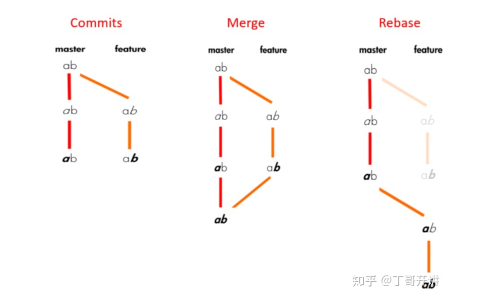
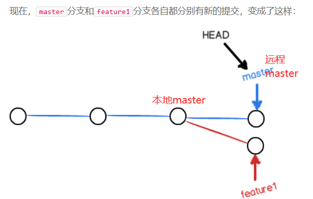
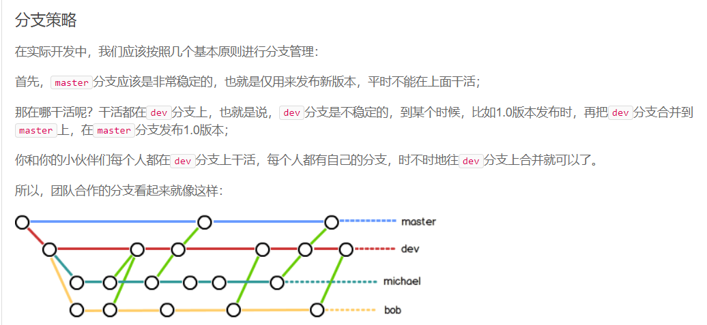

# Git
git add . //git会自动查找变更过的文件然后提交到暂存区

git commit -m '描述'  //提交到本地仓库

git push -u origin master //提交到远程仓库注意配置orign

git push -u origin master -f  //强制push本地仓库到远程 (这种情况不会进行merge, 强制push后远程文件可能会丢失 不建议使用此方法)

git pull origin master //如果无法提交先拉下来再提交

git remote add origin1 码云ssh//可以利用其同步GitHub然后pull包防止过慢 push 不影响

git push -u origin master //把包推到远程仓库的master节点，远程仓库一一匹配 其实就是ssh对应的仓库名称，我们起的别名叫做orign,orign1是码云上的仓库，不起同样的名字防止混淆

git rebase --abort//会放弃合并，回到rebase操作之前的状态，之前的提交的不会丢弃

git merge --no-ff -m "merge with no-ff" dev //合并分支时，加上`--no-ff`参数就可以用普通模式合并，合并后的历史有分支，能看出来曾经做过合并，而`fast forward`合并就看不出来曾经做过合并。

git branch -r //查看远程分支

git branch //查看本地分支

git push origin --delete tmp //删除远程分支tmp

git checkout dev //切换到dev分支（删除分支前先切换到其他分支）

git branch -d tmp //删除本地tmp分支

git push -u orign dev //推向远程dev分支git

git checkout -b dev //创建并切换到分支

git merge dev //在主节点merge   dev节点

git log --oneline --graph --decorate --all   //git 命令代替gitk查看节点树

**流程在dev上新建一个属于自己的分支dev1 在此分支上添加自己的代码，切换到dev从远程pull 然后与dev1进行merge  $git merge dev1  然后$git push -u origin dev 然后$git branch -D dev1**

* 企业开发一般来说先pull远程dev节点下的数据到本地与本地dev分支上的数据进行merge，有冲突解决冲突，没有冲突则merge后再push到远程dev节点

* 注意本地节点必须与远程节点对应上才能往上推，否则出错，merge完成以后记得删除分支

  

  **git config --global pull.rebase true  //这个配置就是告诉git在每次pull前先进行rebase操作。**

  

  **使用git pull --rebase命令，如果没有冲突,则会直接合并，如果存在冲突，手动解决冲突即可，不会再产生那条多余的信息。如果你不想每次都rebase，可以在git bash里执行。比如远程仓库有改动但是你的本地仓库没改  拉下来后commit   然后与你本地dev下的项目add 然后commit  然后到主节点merge会有冲突所以要加上rebase命令  **

git 密钥问题 ssh

# 创建删除远程分支（用于远程仓库创建错了的问题）

先输入 git remote rm origin //删除远程仓库

再输入 git remote add origin  ** //添加远程仓库

# 用于删除远程仓库 节点下某个文件夹

git rm -r --cached 文件名  #--cached不会把本地的.idea删除
git commit -m 'delete 文件名 dir'
git push -u origin master 

# merge 、rebase、fetch的区别

Git鼓励大量使用分支：

查看分支：git branch

创建分支：git branch <name>

切换分支：git checkout <name>或者git switch <name>

创建+切换分支：git checkout -b <name>或者git switch -c <name>

合并某分支到当前分支：git merge <name>

删除分支：git branch -d <name>

当本地master比远程慢的时候，提交本地master上的feature可能会产生冲突，需要把本地master pull下来冲突的地方改为和feature一样再把feature提交上去即可，然后删除feature分支

merge: 合并分支，建议在分支上工作然后再merge到主分支上再删除工作的分支，这样会有进度 

rebase：把分叉的提交历史“整理”成一条直线，看上去更直观。缺点是本地的分叉提交已经被修改过了。rebase的目的是使得我们在查看历史提交的变化时更容易，因为分叉的提交需要三方对比。

fetch：使用git fetch更新代码，本地的库中master的commitID不变，还是等于1。但是与git上面关联的那个orign/master的commit ID变成了2。这时候我们本地相当于存储了两个代码的版本号，我们还要通过merge去合并这两个不同的代码版本，如果这两个版本都修改了同一处的代码，这时候merge就会出现冲突，然后我们解决冲突之后就生成了一个新的代码版本。

# git push -u origin master
To https://github.com/XXX/XXX.git
 ! [rejected]        master -> master (non-fast-forward)
error: failed to push some refs to 'https://github.com/XXX/XXX.git'
hint: Updates were rejected because the tip of your current branch is behind
hint: its remote counterpart. Integrate the remote changes (e.g.
hint: 'git pull ...') before pushing again.
hint: See the 'Note about fast-forwards' in 'git push --help' for details.

解决方法

先把git的东西fetch到你本地属于自己的分支然后rebase后再push,能用rebase就不要用merge