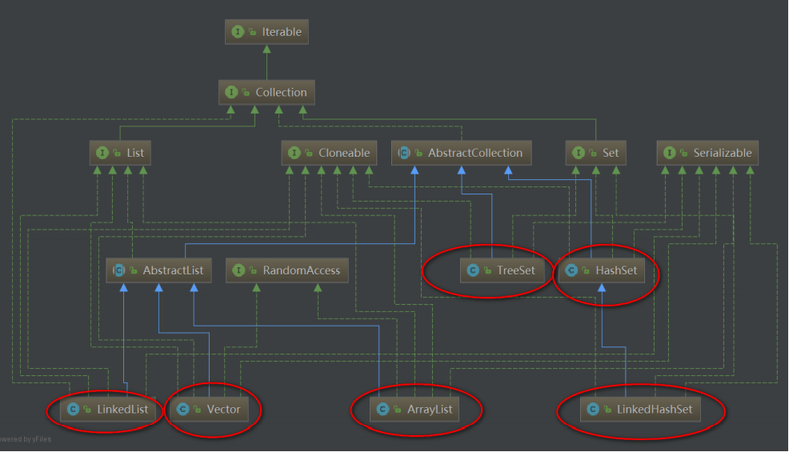
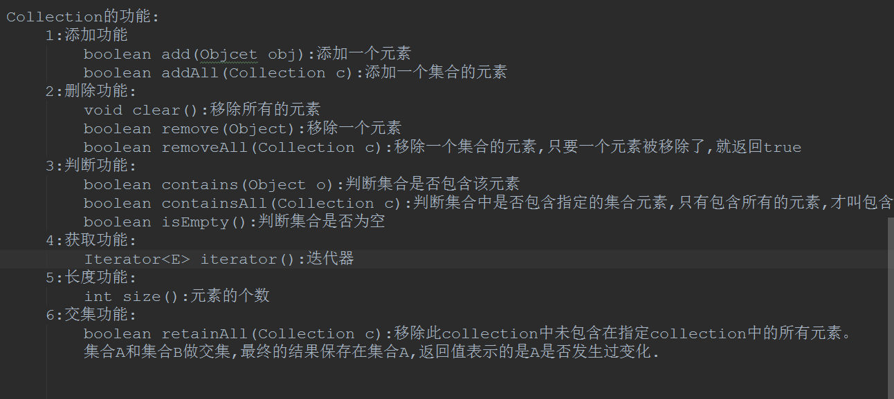
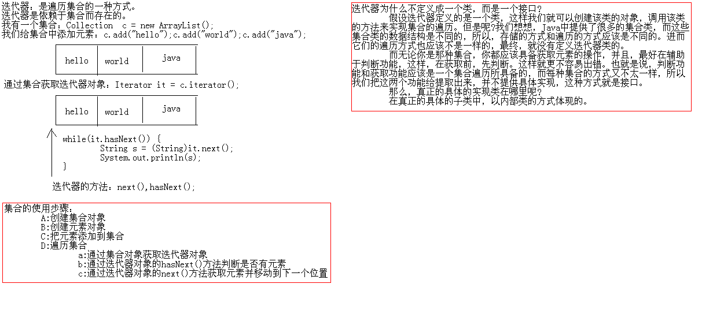
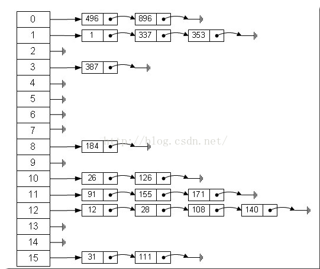
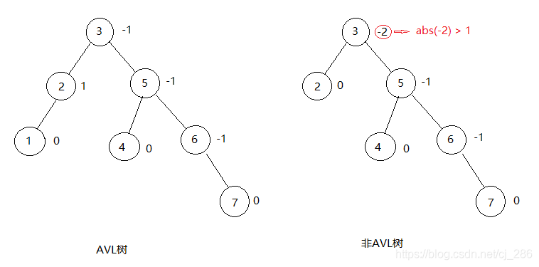
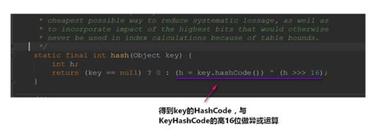
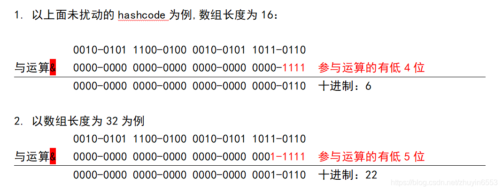

# 1.接口

在接口里面定义一个抽象方法

```java
//创建一接口
package a;//创建一个包，名字为a
public interface aaa1
{
	public int getMax();//创建一个接口方法getMax,都是出现方法需要实现接口然后重写
	String getMes();//创建一个接口方法getMex
}
```

```java
package a;//创建一个包，名字为a
//开发使用该接口的类
import a.aaa1;//引用接口的包
public class test implements aaa1 //test类描述的是实现接口的方法
{
	public int getMax()//实现接口里的方法
	{
		int i=123;
		return i;
	}
	public String getMes()//实现接口里的方法
	{
		String s="实现接口里的方法";
		return s;
	}
	public static void main (String[]args)
	{
		test t=new test();//创建test类的实例对象
		int i=t.getMax();//实现了接口里的方法并进行调用
		String s=t.getMes();
		System.out.println(i);
		System.out.println(s);
	}

}


```

# 2.容器总结(集合)





## 一、Collection



### 1、迭代器(Iterator)介绍

**遍历集合(Collection)的元素都可以使用Iterator**，至于它的具体实现是以内部类的方式实现的！

```java
  hasNext()、next()、remove()

  hasNext:没有指针下移操作，只是判断是否存在下一个元素

  next:指针下移，返回该指针所指向的元素

  remove:删除当前指针所指向的元素，一般和next方法一起用，这时候的作用就是删除next方法返回的元素
      
  nextLine():不会忽略一些字符如空格等。
  next():会忽略一些字符，只记录有效字符。

```




### 2、List与Set常用子类及介绍

**List集合常用的子类有三个：**

•      ArrayList

–     底层数据结构是数组。线程不安全

•      LinkedList

–     底层数据结构是链表。线程不安全

•      Vector

–     底层数据结构是数组。线程安全


 **Set集合的特点是：元素不可重复，常用子类有**

•      HashSet集合

–     A:底层数据结构是哈希表(是一个元素为链表的数组) 

•      TreeSet集合

–     A:底层数据结构是红黑树(是一个自平衡的二叉树)

–     B:保证元素的排序方式

•      LinkedHashSet集合 

–     A:：底层数据结构由哈希表和链表组成。


## 二、List集合

### 1、ArrayList解析


#### 1.1构造方法


#### 1.2add方法

**add(E e)**


•      **确认list容量，尝试容量加1，看看有无必要**

•      **添加元素**


到目前为止，我们就可以知道add(E e)的基本实现了：

•      首先去检查一下数组的容量是否足够

–     足够：直接添加

–     不足够：扩容

•      扩容到原来的1.5倍

•      第一次扩容后，如果容量还是小于minCapacity，就将容量扩充为minCapacity。


**add(int index, E element)**

步骤：

•      **检查角标**

•      **空间检查，如果有需要进行扩容**

•      **插入元素**


我们发现，与扩容相关ArrayList的add方法底层其实都是arraycopy()来实现的

看到arraycopy()，我们可以发现：该方法是由C/C++来编写的，并不是由Java实现：


本地Native方法非常有用，因为它有效地扩充了jvm.事实上，我们所写的java代码已经用到了本地方法，在sun的java的并发（多线程）的机制实现中，许多与操作系统的接触点都用到了本地方法，这使得java程序能够超越java运行时的界限。有了本地方法，java程序可以做任何应用层次的任务。

#### 1.3get方法


```java
 //检查角标
 private void rangeCheck(int index) {
  if (index >= size)
   throw new IndexOutOfBoundsException(outOfBoundsMsg(index));
 }

 //返回元素
 E elementData(int index) {
  return (E) elementData[index];
 }
```

#### 1.4set方法

​				•      **检查角标**

​				•      **替代元素**

​				•      **返回旧值**


#### 1.5remove方法

•      **检查角标**

•      **删除元素**

•      **计算出需要移动的个数，并移动**

•      **设置为null，让Gc回收**


#### 1.6其他一些细节

•      ArrayList是**基于动态数组实现的**，在**增删时候，需要数组的拷贝复制**。

•      ArrayList的默认初始化容量是10，每次扩容时候增加原先容量的一半，也就是变为原来的1.5**倍**

•      删除元素时不会减少容量，**若希望减少容量则调用trimToSize()**。

•      它不是线程安全的。它能存放null值。


### 2、Vector vs ArrayList?

Vector是jdk1.2的类了，比较老旧的一个集合类。


Vector底层也是数组，与ArrayList最大的区别就是：**同步(线程安全)**

Vector是同步的，我们可以从方法上就可以看得出来~


在要求非同步的情况下，我们一般都是使用ArrayList来替代Vector的了~

如果想要ArrayList实现同步，可以使用Collections的方法：**List list = Collections.synchronizedList(new ArrayList(...));**就可以实现同步了~

还有另一个区别：

•      **ArrayList在底层数组不够用时在原来的基础上扩展0.5倍，Vector是扩展1倍。**


### 3、LinkedList解析

LinkedList底层是**双向链表**

单向链表：只有一个指向下一个节点的指针。

优点：单向链表增加删除节点简单。遍历时候不会死循环；

缺点：只能从头到尾遍历。只能找到后继，无法找到前驱，也就是只能前进。

适用于节点的增加删除。

 

双向链表：有两个指针，一个指向前一个节点，一个后一个节点。

优点：可以找到前驱和后继，可进可退；

缺点：增加删除节点复杂，需要多分配一个指针存储空间。

适用于需要双向查找节点值的情况。


从结构上，我们还看到了**LinkedList**实现了Deque接口，因此，我们可以操作LinkedList像操作队列和栈一样~


LinkedList变量就这么几个，因为我们操作单向链表的时候也发现了：有了头结点，其他的数据我们都可以获取得到了。(双向链表也同理)

#### 3.1构造方法

构造方法有两个：


#### 3.2add方法

```java
//add方法实际上就是往链表最后添加元素

   public boolean add(E e) {
     linkLast(e);
     return true;
   }
   void linkLast(E e) {
     final Node<E> l = last;
     final Node<E> newNode = new Node<>(l, e, null);
     last = newNode;
     if (l == null)
       first = newNode;
     else
       l.next = newNode;
     size++;
     modCount++;
   }
```

#### 3.3get方法

我们进去看一下具体的实现是怎么样的：

可以看到get方法实现就两段代码：

```java
 public E get(int index) {
     checkElementIndex(index);
     return node(index).item;
   }
```


#### 3.4set方法

```java
//set方法和get方法其实差不多，**根据下标来判断是从头遍历还是从尾遍历**

  public E set(int index, E element) {
     checkElementIndex(index);
     Node<E> x = node(index);
     E oldVal = x.item;
     x.item = element;
     return oldVal;
   }
```


#### 3.5remove方法

`


### 4、List集合总结

**ArrayList**：

•      底层实现是数组

•      ArrayList的默认初始化容量是10，每次扩容时候增加原先容量的一半，也就是变为原来的1.5倍

•      在**增删时候，需要数组的拷贝复制(navite 方法由C/C++实现)**

**LinkedList**：

•      底层实现是**双向链表**[双向链表方便实现往前遍历

**Vector**：

•      底层是数组，现在已少用，被ArrayList替代，原因有两个：

–     Vector所有方法都是同步，**有性能损失**。

–     Vector初始length是10 超过length时 以100%比率增长，**相比于ArrayList更多消耗内存**。

**总的来说：查询多用ArrayList，增删多用LinkedList**。

**ArrayList**增删慢不是绝对的(在数量大的情况下，已测试)：

•      如果增加元素一直是使用add()(增加到末尾)的话，那是ArrayList要快

•      一直删除末尾的元素也是ArrayList要快【不用复制移动位置】

•      至于如果删除的是中间的位置的话，还是ArrayList！

但一般来说：**增删多还是用LinkedList**，因为上面的情况是极端的~


## 三、Map集合


**Map的子类**


### 1.散列表（Hash表）

散列表为每个对象计算出一个整数，称为散列码。根据这些计算出来的整数(散列码)保存在对应的位置上！

在Java中，散列表用的是链表数组实现的，每个列表称之为桶。

一个桶上可能会遇到被占用的情况(hashCode散列码相同，就存储在同一个位置上)，这种情况是无法避免的，这种现象称之为：散列冲突

•      此时需要**用该对象与桶上的对象进行比较，看看该对象是否存在桶子上了**~如果存在，就不添加了，如果不存在则添加到桶子上

•      当然了，如果hashcode函数设计得足够好，桶的数目也足够，这种比较是很少的~

•      在**JDK1.8**中，**桶满时**会从**链表变成红黑树**

​        如果散列表太满，**是需要对散列表再散列，创建一个桶数更多的散列表，并将原有的元素插入到新表中，丢弃原来的表**

•      装填因子(load factor)**决定了何时**对散列表再散列~

•      装填因子默认为0.75，如果表中**超过了75%**的位置已经填入了元素，那么这个表就会用**双倍的桶数**自动进行再散列。


解释的是最常用的一种方法——拉链法，我们可以理解为“链表的数组”，如图：



​                                                                                         hash表的应用（拉链法）

解决散列冲突通常有以下几种方法：

- 拉链法

- 开放定址法

  **线性探测法**

  如果此时再要插入20，则20 % 7 = 6，但是6的位置已有元素，因此探测下一个位置（6+1）%7，在这里就是下标为0的位置。但这种方式的一个问题是，可能造成**一次聚集**，因为一旦冲突发生，为了处理冲突就会占用下一个位置，而如果冲突较多时，就会出现数据都**聚集在一块区域**。这样就会导致任何关键字都需要多次尝试才可能解决冲突。

  

  **平方探测法**

  顾名思义，如果说前面的探测函数是F（i）= i % 7，那么平方探测法就是F（i）= (i^2 )% 7。但是这也同样会产生**二次聚集**问题。
  
  
  
  **双散列**
  
  为了避免聚集，在探测时选择跳跃式的探测，即再使用一个散列函数，用来计算探测的位置。假设前面的散列函数为hash1(X)，用于探测的散列函数为hash2(X)，那么一种流行的选择是F(i) = i * hash2(X)，即第一次冲突时探测hash1(X)+hash2(X)的位置，第二次探测
  hash1(X)+2hash2(X)的位置。可以看到，无论是哪种开放定址法，它都要求表足够大。
  
  
  
  **再散列**
  
  散列表可以认为是具有固定大小的数组，那么如果插入新的数据时散列表已满，或者散列表所剩容量不多该怎么办？这个时候就需要再散列，常见做法是，建立一个是原来两倍大小的散列表，将原来表中的关键字重新散列到新表中。

**散列表的应用**

​        文件校验或数字签名。当然还有快速查询功能的实现。例如，redis中的字典结构就使用了散列表，使用**MurmurHash算法**来计算字符串的hash值，并采用**拉链法**处理冲突，当散列表的**装载因子**（关键字个数与散列表大小的比）接近某个大小时，进行**再散列**。一个设计良好的散列表能够几乎在O（1）时间复杂度内完成插入，删除和查找，但前提是**散列函数设计得足够优雅，以及有着合适散列冲突解决方案**。


**重写equal需要重写hashcode方法？**

​		假如只重写equals而不重写hashcode，那么Student类的hashcode方法就是Object默认的hashcode方法，由于默认的hashcode方法是根据对象的内存地址经哈希算法得来的，显然此时s1!=s2,故两者的hashcode不一定相等。然而重写了equals，且s1.equals(s2)返回true，根据hashcode的规则，两个对象相等其哈希值一定相等，所以矛盾就产生了，因此重写equals一定要重写hashcode，而且从Student类重写后的hashcode方法中可以看出，重写后返回的新的哈希值与Student的两个属性有关。hashcode的值与类中的具体属性有关。


以下是关于hashcode的一些规定：

两个对象相等，hashcode一定相等
两个对象不等，hashcode不一定不等
hashcode相等，两个对象不一定相等
hashcode不等，两个对象一定不等

### 2.红黑树

**2-3树可以了解一下**




AVL 树是又叫平衡二叉树，平衡二叉树递归定义如下：

1. 左右子树的高度差小于等于 1。

2. 其每一个子树均为平衡二叉树。

AVL树的左旋与右旋 https://blog.csdn.net/qq_25806863/article/details/74755131


但是红黑树的性质是每条路径的黑色节点数目相同这个时候你再想想那其他路径的黑色节点数目一定比你现在少一个节点，所以调整起来是非常繁琐的. 插入红节点不需要调整其他路径，如果它的父亲为黑，那么直接插入，如果他的父亲为红那么在该路径上面开始分情况调整. 所以插入节点默认颜色一定要为红.如果为黑调节成本太大了.


## 四、HashMap

### 1.HashMap刨析


HashMap属性


具体方法


#### 1.1HashMap构造方法


在上面的构造方法最后一行，我们会发现调用了tableSizeFor()，我们进去看看：


看完上面可能会感到奇怪的是：**为啥是将2的整数幂的数赋给threshold**？

•  threshold这个成员变量是阈值，决定了是否要将散列表再散列。它的值应该是：capacity * load factor才对的。

其实这里仅仅是一个初始化，当创建哈希表的时候，它会重新赋值的：


其他构造方法


#### 1.2put方法

**核心**


计算hash值




我们是根据key的哈希值来保存在散列表中的，我们表默认的初始容量是16，要放到散列表中，就是0-15的位置上。

也就是`tab[i = (n - 1) & hash]`。可以发现的是：在做`&`运算的时候，仅仅是**后4位有效(eg:1110=16  四位)**~  , 那如果我们key的哈希值高位变化很大，低位变化很小。直接拿过去做`&`运算，这就会导致计算出来的Hash值相同的很多。



而设计者**将key的哈希值的高位也做了运算(与高16位做异或运算，使得在做&运算时，此时的低位实际上是高位与低位的结合)，这就增加了随机性**，减少了碰撞冲突的可能性！

具体流程如下：


新值返回旧值返回测试


接下来我们看看resize()方法，在初始化的时候要调用这个方法，当散列表元素大于capacity * load factor的时候也是调用resize()


#### 1.3get方法


getNode()的具体实现：


#### 1.4remove方法


removeNode()的实现：


### 2.HashMap与HashTable对比

​		从存储结构和实现来讲基本上都是相同的。它和HashMap的最大的不同是它是线程安全的，另外它不允许key和value为null。Hashtable是个过时的集合类，不建议在新代码中使用，不需要线程安全的场合可以用HashMap替换，需要线程安全的场合可以用ConcurrentHashMap替换


### 3.HashMap总结

在JDK8中HashMap的底层是：**数组+链表(散列表)+红黑树**

在散列表中有装载因子这么一个属性，当装载因子*初始容量小于散列表元素时，该散列表会再散列，扩容2倍！

装载因子的**默认值是0.75**，无论是初始大了还是初始小了对我们HashMap的性能都不好

- 装载因子初始值大了，可以减少散列表再散列(扩容的次数)，但同时会导致散列冲突的可能性变大(**散列冲突也是耗性能的一个操作，要得操作链表(红黑树)**！
- 装载因子初始值小了，可以减小散列冲突的可能性，但同时扩容的次数可能就会变多！

初始容量的**默认值是16**，它也一样，无论初始大了还是小了，对我们的HashMap都是有影响的：

- 初始容量过大，那么遍历时我们的速度就会受影响~
- 初始容量过小，散列表再散列(扩容的次数)可能就变得多，扩容也是一件非常耗费性能的一件事~

从源码上我们可以发现：HashMap并不是直接拿key的哈希值来用的，它会将key的哈希值的高16位进行异或操作，使得我们将元素放入哈希表的时候**增加了一定的随机性**。

还要值得注意的是：**并不是桶子上有8位元素的时候它就能变成红黑树，它得同时满足我们的散列表容量大于64才行的**~


## 五、LinkedHashMap

类的继承图


总结出LinkedHashMap几点：

•      底层是散列表和双向链表

•      允许为null，不同步

•      插入的顺序是有序的(底层链表致使有序)

•      装载因子和初始容量对LinkedHashMap影响是很大的~

同时也给我带了几个疑问：

•      access-ordered和insertion-ordered具体的使用和意思

•      为什么说初始容量对遍历没有影响？

希望可以在看源码的过程中可以解决掉我这两个疑问~~~那接下来就开始吧

### 1.LinkedHashMap

#### 1.1LinkedHash的域


#### 1.2LinkedHash重写的方法


这就印证了我们的LinkedHashMap**底层确确实实是散列表和双向链表**~

•      在构建新节点时，构建的是LinkedHashMap.Entry 不再是Node.


#### 1.3构造方法

默认有五个构造方法


默认使用的是插入顺序


#### 1.4put方法


再顿了一下，原来LinkedHashMap和HashMap的put方法是一样的！LinkedHashMap继承着HashMap，LinkedHashMap没有重写HashMap的put方法

所以，LinkedHashMap的put方法和HashMap是一样的。

当然了，**在创建节点的时候，调用的是**LinkedHashMap**重写的方法**~


#### 1.5get方法


get方法也是多了：**判断是否为访问顺序**~~~

讲到了这里，感觉我们可以简单测试一波了：

首先我们来看看已**插入顺序**来进行插入和遍历：

```java
public static void insertOrder() {

     *//* *默认是插入顺序*
     LinkedHashMap<Integer,String> insertOrder = new LinkedHashMap();
     
     String value = "jerry";
     int i = 0;
     
     insertOrder.put(i++, value);
     insertOrder.put(i++, value);
     insertOrder.put(i++, value);
     insertOrder.put(i++, value);
     insertOrder.put(i++, value);
     
     *//**遍历*
     Set<Integer> set = insertOrder.keySet();
     for (Integer s : set) {
       String mapValue = insertOrder.get(s);
       System.out.println(s + "---" + mapValue);
     }

   }
```


接着，我们来测试一下以**访问顺序**来进行插入和遍历：

```
  public static void accessOrder() {
     *//* *设置为访问顺序的方式*
     LinkedHashMap<Integer,String> accessOrder = new LinkedHashMap(16, 0.75f, true);

     String value = "关注公众号Java3y";
     int i = 0;
     accessOrder.put(i++, value);
     accessOrder.put(i++, value);
     accessOrder.put(i++, value);
     accessOrder.put(i++, value);
     accessOrder.put(i++, value);

 


     *//* *遍历*
     Set<Integer> sets = accessOrder.keySet();
     for (Integer key : sets) {
       String mapValue = accessOrder.get(key);
       System.out.println(key + "---" + mapValue);
     }

   }
```

代码**看似**是没有问题，但是运行会出错的！


前面在看源码注释的时候我们就发现了：**在****AccessOrder**的情况下，使用get方法也是结构性的修改**！

为了简单看出他俩的区别，下面我就直接用key来进行看了~

以下是**访问顺序的测试**：

```
public static void accessOrder() {
     *//* *设置为访问顺序的方式*
     LinkedHashMap<Integer,String> accessOrder = new LinkedHashMap(16, 0.75f, true);

     String value = "关注公众号Java3y";
     int i = 0;
     accessOrder.put(i++, value);
     accessOrder.put(i++, value);
     accessOrder.put(i++, value);
     accessOrder.put(i++, value);
     accessOrder.put(i++, value);

 


     *//* *访问一下key**为3**的元素再进行遍历*
     accessOrder.get(3);
     
     *//* *遍历*
     Set<Integer> sets = accessOrder.keySet();
     for (Integer key : sets) {
     
       System.out.println(key );
     }

   }
```

测试结果：


以下是**插入顺序的测试**(代码就不贴了，和上面几乎一样)：


我们可以这样理解：**最常用的将其放在链表的最后，不常用的放在链表的最前**~

这个知识点以我的理解而言，它这个**访问顺序在**LinkedHashMap**如果不重写用处并不大**~它是用来给别的实现进行**扩展**的

•      **因为最常被使用的元素再遍历的时候却放在了最后边，在LinkedHashMap**中我也没找到对应的方法来进行调用~

•      一个removeEldestEntry(Map.Entry<K,V> eldest)方法，**重写它可以删除最久未被使用的元素**！！

•      还有一个是afterNodeInsertion(boolean evict)方法，**新增时判断是否需要删除最久未被使用的元素**！！


#### 1.6remove方法

对于remove方法，在LinkedHashMap中也没有重写，它调用的还是父类的HashMap的remove()方法，在LinkedHashMap中重写的是：afterNodeRemoval(Node<K,V> e) 这个方法


当然了，在remove的时候会涉及到上面重写的方法：


#### 1.7遍历的方法

Set<Map.Entry<K,V>> entrySet()是被重写的了


看到了这里，我们就知道为啥注释说：**初始容量对遍历没有影响**

因为它遍历的是**LinkedHashMap**内部维护的一个双向链表，而不是散列表(当然了，链表双向链表的元素都来源于散列表)


### 2.LinkedHashMap总结

LinkedHashMap比 HashMap多了一个双向链表的维护，在数据结构而言它要复杂一些，阅读源码起来比较轻松一些，因为大多都由HashMap实现了..

阅读源码的时候我们会发现多态是无处不在的~子类用父类的方法，子类重写了父类的**部分**方法即可达到不一样的效果！

•      比如：LinkedHashMap并没有重写put方法，而put方法内部的newNode()方法重写了。LinkedHashMap调用父类的put方法，里面回调的是重写后的newNode()，从而达到目的！

LinkedHashMap可以设置两种遍历顺序：

•      访问顺序（access-ordered）

•      插入顺序（insertion-ordered）

•      **默认是插入顺序的**

对于访问顺序，它是LRU(最近最少使用)算法的实现，要使用它要么**重写**LinkedListMap**的几个方法**(removeEldestEntry(Map.Entry<K,V> eldest)和afterNodeInsertion(boolean evict))，要么是**扩展**成LRUMap来使用，不然设置为访问顺序（access-ordered）的用处不大~

**LinkedHashMap**遍历的是内部维护的双向链表，所以说初始容量对LinkedHashMap遍历是不受影响的


## 六、TreeMap


TreeMap实现了NavigableMap接口，而NavigableMap接口继承着SortedMap接口，致使我们的**TreeMap**是有序的！

•      TreeMap底层是红黑树，它方法的时间复杂度都不会太高:log(n)~

•      非同步

•      使用Comparator或者Comparable来比较key是否相等与排序的问题~


reeMap有序是通过Comparator来进行比较的，如果comparator为null，那么就使用自然顺序~

打个比方：如果value是整数，自然顺序指的就是我们平常排序的顺序(1,2,3,4,5..)~

```
 TreeMap<Integer, Integer> treeMap = new TreeMap<>();

   treeMap.put(1, 5);
   treeMap.put(2, 4);
   treeMap.put(3, 3);
   treeMap.put(4, 2);
   treeMap.put(5, 1);

   for (Entry<Integer, Integer> entry : treeMap.entrySet()) {
   String s = entry.getKey() +"关注公众号：Java3y---->" + entry.getValue();
 
   System.out.println(s);
   }
```


### 1.put方法


```
下面是compare(Object k1, Object k2)方法

  /*
  Compares two keys using the correct comparison method for this TreeMap
  */
   @SuppressWarnings("unchecked")
   final int compare(Object k1, Object k2) {
     return comparator==null ? ((Comparable<? super K>)k1).compareTo((K)k2)
       :comparator.compare((K)k1, (K)k2);
   }

如果我们设置key为null，会抛出异常的
```

### 2.get方法


如果Comparator不为null，接下来我们进去看看getEntryUsingComparator(Object key)，是怎么实现的


### 3.remove方法


删除节点的时候调用的是**deleteEntry(Entry<K,V> p)**方法，这个方法主要是删除节点并且平衡红黑树平衡红黑树的代码是比较复杂的，我就不说了，你们去看吧(反正我看不懂)....

### 4.遍历方法


### 5.总 结

TreeMap底层是红黑树，能够实现该Map集合有序~

如果在构造方法中传递了Comparator对象，那么就会以Comparator对象的方法进行比较。否则使用Comparable的compareTo(T o)方法来比较。

•   值得说明的是：如果使用的是compareTo(T o)方法来比较，key一定是不能为null，并且得实现了Comparable接口的。

•   即使是传入了Comparator对象，不用compareTo(T o)方法来比较，key也是不能为null的

```
public static void main(String[] args) {
     TreeMap<Student, String> map = new TreeMap<Student, String>((o1, o2) -> {
       *//**主要条件*
       int num = o1.getAge() - o2.getAge();
       *//**次要条件*
   int num2 = num == 0 ? o1.getName().compareTo(o2.getName()) : num;
 
   return num2;
 });
 
 *//**创建学生对象*
 Student s1 = new Student("潘安", 30);
 Student s2 = new Student("柳下惠", 35);
 
 *//**添加元素进集合*
 map.put(s1, "宋朝");
 map.put(s2, "元朝");
 map.put(null, "汉朝");
 
 *//**获取key**集合*
 Set<Student> set = map.keySet();
 
 *//**遍历key**集合*
 for (Student student : set) {
   String value = map.get(student);
   System.out.println(student + "---------" + value);
 }
 }
       
```


我们从源码中的很多地方中发现：Comparator和Comparable出现的频率是很高的，因为TreeMap实现有序要么就是外界传递进来Comparator对象，要么就使用默认key的Comparable接口(实现自然排序)

最后我就来总结一下TreeMap要点吧：

\1.     由于底层是红黑树，那么时间复杂度可以保证为log(n)

\2.     key不能为null，为null为抛出NullPointException的

\3.     想要自定义比较，在构造方法中传入Comparator对象，否则使用key的自然排序来进行比较

\4.     TreeMap非同步的，想要同步可以使用Collections来进行封装


## 七、Set集合

### 1.Hashset


从顶部注释来看，我们就可以归纳HashSet的要点了：

•      实现Set接口

•      **不保证迭代顺序**

•      **允许元素为null**

•      底层实际上是一个HashMap实例

•      非同步

•      初始容量非常影响迭代性能

底层实际上是一个HashMap实例


HashSet整个类的方法和属性


我们知道Map是一个映射，有key有value，**既然**HashSet底层用的是HashMap，那么value在哪里呢？


value是一个Object，所有的value都是它

所以可以直接总结出：HashSet实际上就是封装了HashMap，**操作**HashSet元素实际上就是操作HashMap**。这也是面向对象的一种体现，**重用性贼高！


### 2.TreeSet


TreeSet顶部注释：


从顶部注释来看，我们就可以归纳TreeSet的要点了：

•      实现NavigableSet接口

•      可以实现排序功能

•      **底层实际上是一个TreeMap**实例

•      非同步


### 3.LinkedHashSet刨析


LinkedHashSet顶部注释：


从顶部注释来看，我们就可以归纳LinkedHashSet的要点了：

•      迭代是有序的

•      允许为null

•      **底层实际上是一个HashMap+双向链表实例(**其实就是LinkedHashMap).

•      非同步

•      性能比HashSet差一丢丢，因为要维护一个双向链表

•      初始容量与迭代无关，LinkedHashSet迭代的是双向链表

### 4.set集合总结

可以很明显地看到，**Set**集合的底层就是Map，所以我都没有做太多的分析在上面，也没什么好分析的了。

下面总结一下Set集合常用的三个子类吧：

**HashSet**：

•      无序，允许为null，底层是HashMap(散列表+红黑树)，非线程同步

**TreeSet**：

•      有序，不允许为null，底层是TreeMap(红黑树),非线程同步

**LinkedHashSet**：

•      迭代有序，允许为null，底层是  HashMap+双向链表，非线程同步


## 八、CopyOnWriteArrayList

### 1.Vector和SynchronizedList

#### 1.1回顾线程安全的Vector和SynchronizedList

我们知道ArrayList是用于替代Vector的，Vector是线程安全的容器。因为它几乎在每个方法声明处都加了**synchronized**关键字来使容器安全。


如果使用Collections.synchronizedList(new ArrayList())来使ArrayList变成是线程安全的话，也是几乎都是每个方法都加上synchronized关键字的，只不过**它不是加在方法的声明处，而是方法的内部**。


#### 1.2Vector和SynchronizedList可能会出现的问题

```java
下面我们直接来看一下这段代码：

  *//* *得到Vector**最后一个元素*
   public static Object getLast(Vector list) {
     int lastIndex = list.size() - 1;
     return list.get(lastIndex);
   }

   *//* *删除Vector**最后一个元素*
   public static void deleteLast(Vector list) {
     int lastIndex = list.size() - 1;
     list.remove(lastIndex);
   }
```

以我们第一反应来分析一下上面两个方法：**在多线程环境下，是否有问题**？

•      我们可以知道的是Vector的size()和get()以及remove()都被synchronized修饰的。

答案：**从调用者的角度是有问题的**

```java
我们可以写段代码测试一下：

import java.util.Vector;

 public class UnsafeVectorHelpers {


   public static void main(String[] args) {

     *//* *初始化Vector*
     Vector<String> vector = new Vector();
     vector.add("关注公众号");
     vector.add("Java3y");
     vector.add("买Linux可到我下面的链接，享受最低价");
     vector.add("给3y加鸡腿");
     
     new Thread(() -> getLast(vector)).start();
     new Thread(() -> deleteLast(vector)).start();
     new Thread(() -> getLast(vector)).start();
     new Thread(() -> deleteLast(vector)).start();

   }

   *//* *得到Vector**最后一个元素*
   public static Object getLast(Vector list) {
     int lastIndex = list.size() - 1;
     return list.get(lastIndex);
   }

   *//* *删除Vector**最后一个元素*
   public static void deleteLast(Vector list) {
     int lastIndex = list.size() - 1;
     list.remove(lastIndex);
   }
 }
```

可以发现的是，有可能会抛出异常的：


原因也很简单，我们照着流程走一下就好了：

•      线程A执行getLast()方法，线程B执行deleteLast()方法

•      线程A执行int lastIndex = list.size() - 1;得到lastIndex的值是3。**同时**，线程B执行int lastIndex = list.size() - 1;得到的lastIndex的值**也**是3

•      此时线程B先得到CPU执行权，执行list.remove(lastIndex)将下标为3的元素删除了

•      接着线程A得到CPU执行权，执行list.get(lastIndex);，发现已经没有下标为3的元素，抛出异常了.


出现这个问题的原因也很简单：

•      getLast()和deleteLast()这两个方法并不是原子性的，即使他们**内部的每一步操作是原子性**的(被Synchronize修饰就可以实现原子性)，但是内部之间还是可以**交替**执行。

–     这里的意思就是：size()和get()以及remove()都是原子性的，但是如果并发执行getLast()和deleteLast()，方法里面的size()和get()以及remove()是可以交替执行的。

要解决上面这种情况也很简单，因为我们都是对Vector进行操作的，**只要操作**Vector前把它锁住就没毛病了！

所以我们可以改成这样子：

```java
   //* *得到Vector**最后一个元素*
   public static Object getLast(Vector list) {
     synchronized (list) {
       int lastIndex = list.size() - 1;
       return list.get(lastIndex);
     }
   }
   //* *删除Vector**最后一个元素*
   public static void deleteLast(Vector list) {
     synchronized (list) {
       int lastIndex = list.size() - 1;
       list.remove(lastIndex);
     }
   }
```

ps:如果有人去测试一下，发现会抛出异常java.lang.ArrayIndexOutOfBoundsException: -1，这是**没有检查角标的异常**，不是并发导致的问题。

经过上面的例子我们可以看看下面的代码：

```java
public static void main(String[] args) {

     *//* *初始化Vector*
     Vector<String> vector = new Vector();
     vector.add("关注公众号");
     vector.add("Java3y");
     vector.add("买Linux可到我下面的链接，享受最低价");
     vector.add("给3y加鸡腿");
     
     *//* *遍历Vector*
     for (int i = 0; i < vector.size(); i++) {
     
       *//* *比如在这执行vector.clear();*
       *//new Thread(() -> vector.clear()).start();*
     
       System.out.println(vector.get(i));
     }

   }
```

同样地：如果在遍历Vector的时候，有别的线程修改了Vector的长度，那还是会**有问题**！

•      线程A遍历Vector，执行vector.size()时，发现Vector的长度为5

•      此时**很有可能存在**线程B对Vector进行clear()操作

•      随后线程A执行vector.get(i)时，抛出异常


在JDK5以后，Java推荐使用for-each(迭代器)来遍历我们的集合，好处就是**简洁、数组索引的边界值只计算一次**。

如果使用for-each(迭代器)来做上面的操作，会抛出ConcurrentModificationException异常


SynchronizedList在使用**迭代器遍历**的时候同样会有问题的，源码已经提醒我们要手动加锁了。


如果想要完美解决上面所讲的问题，我们可以在**遍历前加锁**：

```java
   *//* *遍历Vector*
   synchronized (vector) {
      for (int i = 0; i < vector.size(); i++) {
       vector.get(i);
     }
   }
```


有经验的同学就可以知道：**哇，遍历一下容器都要我加上锁，这这这不是要慢死了吗**.的确是挺慢的..

所以我们的CopyOnWriteArrayList就登场了！


### 2.CopyOnWriteArrayList(Set)介绍

一般来说，我们会认为：CopyOnWriteArrayList是同步List的替代品，CopyOnWriteArraySet是同步Set的替代品。

无论是Hashtable-->ConcurrentHashMap，还是说Vector-->CopyOnWriteArrayList。JUC下支持并发的容器与老一代的线程安全类相比，总结起来就是加锁**粒度**的问题

•      Hashtable、Vector加锁的粒度大(直接在方法声明处使用synchronized)

•      ConcurrentHashMap、CopyOnWriteArrayList加锁粒度小(用各种的方式来实现线程安全，比如我们知道的ConcurrentHashMap用了cas锁、volatile等方式来实现线程安全..)

•      JUC下的线程安全容器在遍历的时候**不会**抛出ConcurrentModificationException异常

所以一般来说，我们都会**使用**JUC包下给我们提供的线程安全容器，而不是使用老一代的线程安全容器。

下面我们来看看CopyOnWriteArrayList是怎么实现的，为什么使用**迭代器遍历**的时候就**不用额外加锁**，也不会抛出ConcurrentModificationException异常。

#### 2.1 CopyOnWriteArrayList实现原理

我们还是先来回顾一下COW：

如果有多个调用者（callers）同时请求相同资源（如内存或磁盘上的数据存储），他们会共同获取**相同的指针指向相同的资源**，直到某个调用者**试图修改**资源的内容时，系统才会**真正复制一份专用副本**（private copy）给该调用者，而其他调用者所见到的最初的资源仍然保持不变。**优点**是如果调用者**没有修改该资源，就不会有副本**（private copy）被建立，因此多个调用者只是读取操作时可以**共享同一份资源**。

**之前写博客的时候，如果是要看源码，一般会翻译一下源码的注释并用图贴在文章上的。Emmm，发现阅读体验并不是很好，所以我这里就直接概括一下源码注释说了什么吧。另外，如果使用IDEA的话，可以下一个插件Translation(免费好用).**


概括一下CopyOnWriteArrayList源码注释介绍了什么：

•      CopyOnWriteArrayList是线程安全容器(相对于ArrayList)，底层通过**复制数组**的方式来实现。

•      CopyOnWriteArrayList在遍历的使用不会抛出ConcurrentModificationException异常，并且遍历的时候就不用额外加锁

•      元素可以为null


##### 2.1.1  看一下CopyOnWriteArrayList基本的结构

```java
   /*** 可重入锁对象 **/*
   final transient ReentrantLock lock = new ReentrantLock();

   */*** CopyOnWriteArrayList底层由数组实现，volatile修饰 **/*
   private transient volatile Object[] array;

   */***
   *** 得到数组
   **/*
   final Object[] getArray() {
     return array;
   }

   */***
   *** 设置数组
   **/*
   final void setArray(Object[] a) {
     array = a;
   }

   */***
   *** 初始化CopyOnWriteArrayList相当于初始化数组
   **/*
   public CopyOnWriteArrayList() {
     setArray(new Object[0]);
   }
```

看起来挺简单的，CopyOnWriteArrayList底层就是数组，加锁就交由ReentrantLock来完成。


##### 2.1.2 常见方法的实现

根据上面的分析我们知道如果遍历Vector/SynchronizedList是需要自己手动加锁的。

CopyOnWriteArrayList使用迭代器遍历时不需要显示加锁，看看add()、clear()、remove()与get()方法的实现可能就有点眉目了。

首先我们可以看看add()方法

```java
 public boolean add(E e) {
    
    *//* *加锁*
     final ReentrantLock lock = this.lock;
     lock.lock();
     try {
      
      *//* *得到原数组的长度和元素*
       Object[] elements = getArray();
       int len = elements.length;
      
      *//* *复制出一个新数组*
       Object[] newElements = Arrays.copyOf(elements, len + 1);
      
      *//* *添加时，将新元素添加到新数组中*
       newElements[len] = e;
      
      *//* *将volatile Object[] array* *的指向替换成新数组*
       setArray(newElements);
       return true;
     } finally {
       lock.unlock();
     }

   }
```

通过代码我们可以知道：在添加的时候就上锁，并**每次复制一个新数组，增加操作在新数组上完成，将**array**指向到新数组中**，最后解锁。

再来看看size()方法：

```java
 public int size() {

    *//* *直接得到array**数组的长度*
     return getArray().length;
   }
```

再来看看get()方法：

```java
public E get(int index) {
     return get(getArray(), index);
   }

   final Object[] getArray() {
     return array;
   }
```

那再来看看set()方法

```java
public E set(int index, E element) {
   final ReentrantLock lock = this.lock;
   lock.lock();
   try {
    

    *//* *得到原数组的旧值*
    Object[] elements = getArray();
    E oldValue = get(elements, index);
     
    *//* *判断新值和旧值是否相等*
    if (oldValue != element) {
      
      *//* *复制新数组，新值在新数组中完成*
      int len = elements.length;
      Object[] newElements = Arrays.copyOf(elements, len);
      newElements[index] = element;
      
      *//* *将array**引用指向新数组*
      setArray(newElements);
    } else {
      //Not quite a no-op; enssures volatile write semantics
      setArray(elements);
    }
    return oldValue;

   } finally {
    lock.unlock();
   }
 }
```

对于remove()、clear()跟set()和add()是类似的，这里我就不再贴出代码了。


总结：

•      **在修改时，复制出一个新数组，修改的操作在新数组中完成，最后将新数组交由array变量指向。**

•      **写加锁，读不加锁**

##### 2.1.3 剖析为什么遍历时不用调用者显式加锁

常用的方法实现我们已经基本了解了，但还是不知道为啥能够在容器遍历的时候对其进行修改而不抛出异常。所以，来看一下他的迭代器吧：

```java
   // 1.* *返回的迭代器是COWIterator*
   public Iterator<E> iterator() {
     return new COWIterator<E>(getArray(), 0);
   }


   // 2.* *迭代器的成员属性*
   private final Object[] snapshot;
   private int cursor;

   // 3.* *迭代器的构造方法*
   private COWIterator(Object[] elements, int initialCursor) {
     cursor = initialCursor;
     snapshot = elements;
   }

   // 4.* *迭代器的方法...*
   public E next() {
     if (! hasNext())
       throw new NoSuchElementException();
     return (E) snapshot[cursor++];
   }

   //可以发现的是，迭代器所有的操作都基于snapshot数组，而snapshot是传递进来的array数组到这里，我们应该就可以想明白了！CopyOnWriteArrayList在使用迭代器遍历的时候，操作的都是原数组！
```


##### 2.1.4 CopyOnWriteArrayList缺点

看了上面的实现源码，我们应该也大概能分析出CopyOnWriteArrayList的缺点了。

•      **内存占用**：如果CopyOnWriteArrayList经常要增删改里面的数据，经常要执行add()、set()、remove()的话，那是比较耗费内存的。

–     因为我们知道每次add()、set()、remove()这些增删改操作都要**复制一个数组**出来。

•      **数据一致性**：CopyOnWrite容器**只能保证数据的最终一致性，不能保证数据的实时一致性**。

–     从上面的例子也可以看出来，比如线程A在迭代CopyOnWriteArrayList容器的数据。线程B在线程A迭代的间隙中将CopyOnWriteArrayList部分的数据修改了(已经调用setArray()了)。但是线程A迭代出来的是原有的数据。

##### 2.1.5 CopyOnWriteSet

```java
//CopyOnWriteArraySet的原理就是CopyOnWriteArrayList。
private final CopyOnWriteArrayList<E> al;
   public CopyOnWriteArraySet() {
     al = new CopyOnWriteArrayList<E>();
   }

```

## 九、常见问题

- Collection
  - List
    - **ArrayList**
    - LinkedList
    - Vector(了解，已过时)
  - Set
    - **HashSet**
      - LinkedHashSet
    - TreeSet
- Map
  - **HashMap**
    - LinkedHashMap
  - TreeMap
  - ConcurrentHashMap
  - Hashtable(了解，，已过时)

### 一、ArrayList和Vector的区别

**共同点：**

- 这两个类都实现了List接口，它们都是**有序**的集合(存储有序)，**底层是数组**。我们可以按位置索引号取出某个元素，**允许元素重复和为null**。

**区别：**

- **同步性：**
  - ArrayList是非同步的
  - Vector是同步的
  - 即便需要同步的时候，我们可以使用Collections工具类来构建出同步的ArrayList而不用Vector
- **扩容大小：**
  - Vector增长原来的一倍，ArrayList增长原来的0.5倍

### 二、HashMap和Hashtable的区别

**共同点：**

- 从存储结构和实现来讲基本上都是相同的，都是实现Map接口~

**区别：**

- **同步性：**
  - HashMap是非同步的
  - Hashtable是同步的
  - 需要同步的时候，我们往往不使用，而使用ConcurrentHashMap[ConcurrentHashMap基于JDK1.8源码剖析](https://mp.weixin.qq.com/s?__biz=MzI4Njg5MDA5NA==&mid=2247484161&idx=1&sn=6f52fb1f714f3ffd2f96a5ee4ebab146&chksm=ebd74200dca0cb16288db11f566cb53cafc580e08fe1c570e0200058e78676f527c014ffef41#rd)
- **是否允许为null：**
  - HashMap允许为null
  - Hashtable不允许为null
- **contains方法**
  - 这知识点是在牛客网刷到的，没想到这种题还会有(我不太喜欢)....
  - Hashtable有contains方法
  - HashMap把Hashtable的contains方法去掉了，改成了containsValue和containsKey
- **继承不同：**
  - HashMap<K,V> extends AbstractMap<K,V>
  - public class Hashtable<K,V> extends Dictionary<K,V>

### 三、List和Map的区别

- **存储结构不同**：
  - List是存储单列的集合
  - Map存储的是key-value键值对的集合
- **元素是否可重复**：
  - List允许元素重复
  - Map不允许key重复
- **是否有序**：
  - List集合是有序的(存储有序)
  - Map集合是无序的(存储无序)

### 四、Set里的元素是不能重复的，那么用什么方法来区分重复与否呢? 是用==还是equals()?

我们知道Set集合实际**大都使用的是**Map集合的put方法来添加元素。

以HashSet为例，HashSet里的元素不能重复，在源码(HashMap)是这样体现的：

```java
   // 1.* *如果key* *相等* 
   if (p.hash == hash &&
     ((k = p.key) == key || (key != null && key.equals(k))))
     e = p;
   // 2.* *修改对应的value*
     if (e != null) { *// existing mapping for key*
       V oldValue = e.value;
       if (!onlyIfAbsent || oldValue == null)
         e.value = value;
       afterNodeAccess(e);
       return oldValue;
    }
```

添加元素的时候，如果key(也对应的Set集合的元素)相等，那么则修改value值。而在Set集合中，value值仅仅是一个Object对象罢了(**该对象对Set**本身而言是无用的)。

也就是说：Set集合如果添加的元素相同时，**是根本没有插入的**(仅修改了一个无用的value值)**！从源码(HashMap)中也看出来，**==和equals()方法都有使用！

### 五、Collection和Collections的区别

1. Collection是集合的上级**接口**，继承它的有Set和List接口

2. Collections是集合的**工具类**，提供了一系列的静态方法对集合的搜索、查找、同步等操作

### 六、说出ArrayList,LinkedList的存储性能和特性

ArrayList的底层是数组，LinkedList的底层是双向链表。

•      ArrayList它支持以角标位置进行索引出对应的元素(随机访问)，而LinkedList则需要遍历整个链表来获取对应的元素。因此**一般来说**ArrayList**的访问速度是要比LinkedList**要快的

•      ArrayList由于是数组，对于删除和修改而言消耗是比较大(复制和移动数组实现)，LinkedList是双向链表删除和修改只需要修改对应的指针即可，消耗是很小的。因此**一般来说**LinkedList**的增删速度是要比ArrayList**要快的

#### 6.1扩展

ArrayList的增删**未必**就是比LinkedList要慢。

•      如果增删都是在**末尾**来操作【每次调用的都是remove()和add()】，此时ArrayList就不需要移动和复制数组来进行操作了。如果数据量有百万级的时，**速度是会比**LinkedList**要快的**。(我测试过)

•      如果**删除操作**的位置是在**中间**。由于LinkedList的消耗主要是在遍历上，ArrayList的消耗主要是在移动和复制上(底层调用的是arraycopy()方法，是native方法)。

–     LinkedList的遍历速度是要慢于ArrayList的复制移动速度的

–     如果数据量有百万级的时，**还是**ArrayList**要快**。

### 七、Enumeration和Iterator接口的区别

这个我在前面的文章中也没有详细去讲它们，只是大概知道的是：Iterator替代了Enumeration，Enumeration是一个旧的迭代器了。

与Enumeration相比，Iterator更加安全，**因为当一个集合正在被遍历的时候，它会阻止其它线程去修改集合**。

•      我们在做练习的时候，迭代时会不会经常出错，抛出ConcurrentModificationException异常，说我们在遍历的时候还在修改元素。

•      这其实就是fail-fast机制~具体可参考博文：[*https://blog.csdn.net/panweiwei1994/article/details/77051261*


**区别有三点：**

•      Iterator的方法名比Enumeration更科学

•      Iterator有fail-fast机制，比Enumeration更安全

•      Iterator能够删除元素，Enumeration并不能删除元素

### 八、ListIterator有什么特点

 ListIterator**继承了**Iterator接口，它用于**遍历**List**集合的元素**。

• ListIterator可以实现**双向遍历**,添加元素，设置元素

看一下源码的方法就知道了：


### 九、并发集合类是什么？

Java1.5并发包（java.util.concurrent）**包含线程安全集合类，允许在迭代时修改集合**。

•    Utils包下的集合迭代器被设计为fail-fast的，会抛出ConcurrentModificationException。但java.util.concurrent的并不会。

•    一部分类为：

–     CopyOnWriteArrayList

–     ConcurrentHashMap

–     CopyOnWriteArraySet

### 十、Java中HashMap的key值要是为类对象则该类需要满足什么条件？

**需要同时重写该类的hashCode()**方法和它的equals()**方法**。

•      从源码可以得知，在插入元素的时候是**先算出该对象的**hashCode。如果hashcode相等话的。那么表明该对象是存储在同一个位置上的。

•      如果调用equals()方法，**两个**key相同**，则**替换元素

•      如果调用equals()方法，**两个**key不相同，则说明该**hashCode**仅仅是碰巧相同，此时是散列冲突，将新增的元素放在桶子上

一般来说，我们会认为：只要两个对象的成员变量的值是相等的，那么我们就认为这两个对象是相等的！因为，**Object底层比较的是两个对象的地址**，而对我们开发来说这样的意义并不大~这也就为什么我们要重写equals()方法

重写了equals()方法，就要重写hashCode()的方法。因为equals()**认定了这两个对象相同**，而**同一个对象调用**hashCode()**方法时**，是应该返回相同的值的！

### 十一、与Java集合框架相关的有哪些最好的实践

1. **根据需要**确定集合的类型。如果是单列的集合，我们考虑用Collection下的子接口ArrayList和Set。如果是映射，我们就考虑使用Map~
2. 确定完我们的集合类型，我们接下来**确定使用该集合类型下的哪个子类**~我认为可以简单分成几个步骤：
   - 是否需要同步
     - 去找线程安全的集合类使用
   - 迭代时是否需要有序(插入顺序有序)
     - 去找Linked双向列表结构的
   - 是否需要排序(自然顺序或者手动排序)
     - 去找Tree红黑树类型的(JDK1.8) 
3. 估算存放集合的数据量有多大，无论是List还是Map，它们实现动态增长，都是有性能消耗的。在初始集合的时候给出一个**合理的容量**会减少动态增长时的消耗~
4. **使用泛型**，避免在运行时出现ClassCastException
5. 尽可能使用Collections工具类，或者获取只读、同步或空的集合，**而非编写自己的实现**。它将会提供代码重用性，它有着更好的稳定性和可维护性

### 十二、ArrayList集合加入1万条数据，应该怎么提高效率

ArrayList的默认初始容量为10，要插入大量数据的时候需要不断扩容，而扩容是非常影响性能的。因此，现在明确了10万条数据了，我们可以**直接在初始化的时候就设置**ArrayList**的容量**！

这样就可以提高效率了~


# 3.异常


# 4.泛型


# 5.反射


# 6.注解


@SuppressWarning()：J2SE 提供的一个批注或者注解。该批注的作用是给编译器一条指令，忽略这些警告信息。 


# 7.I/O


# 8.图形化（Swing）

待学习。

# 9.JAVA关键字


一、break ,continue ,return 的区别及作用

break 跳出总上一层循环，不再执行循环(结束当前的循环体)
continue 跳出本次循环，继续执行下次循环(结束正在执行的循环 进入下一个循环条件)
return 程序返回，不再执行下面的代码(结束当前的方法 直接返回)