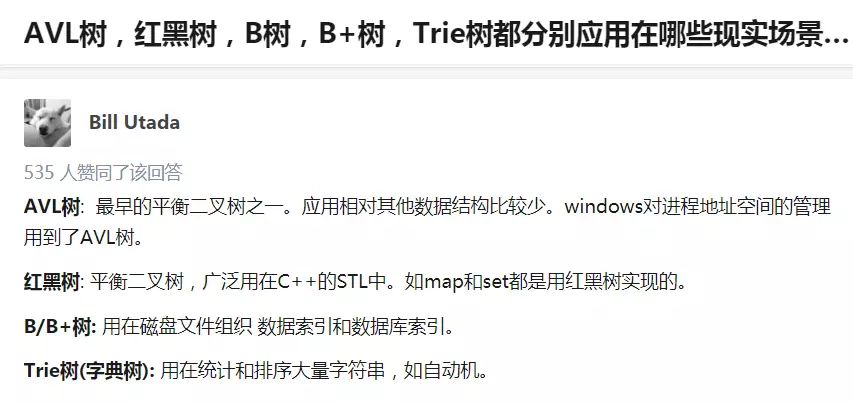

# 接口

在接口里面定义一个抽象方法

```java
//创建一接口
package a;//创建一个包，名字为a
public interface aaa1
{
	public int getMax();//创建一个接口方法getMax,都是出现方法需要实现接口然后重写
	String getMes();//创建一个接口方法getMex
}
```

```java
package a;//创建一个包，名字为a
//开发使用该接口的类
import a.aaa1;//引用接口的包
public class test implements aaa1 //test类描述的是实现接口的方法
{
	public int getMax()//实现接口里的方法
	{
		int i=123;
		return i;
	}
	public String getMes()//实现接口里的方法
	{
		String s="实现接口里的方法";
		return s;
	}
	public static void main (String[]args)
	{
		test t=new test();//创建test类的实例对象
		int i=t.getMax();//实现了接口里的方法并进行调用
		String s=t.getMes();
		System.out.println(i);
		System.out.println(s);
	}

}


```

# 容器(集合)

**先了解一下散列表和红黑树**




AVL 树是又叫平衡二叉树，平衡二叉树递归定义如下：

1. 左右子树的高度差小于等于 1。

2. 其每一个子树均为平衡二叉树。

AVL树的左旋与右旋 https://blog.csdn.net/qq_25806863/article/details/74755131

## 红黑树


但是红黑树的性质是每条路径的黑色节点数目相同这个时候你再想想那其他路径的黑色节点数目一定比你现在少一个节点，所以调整起来是非常繁琐的. 插入红节点不需要调整其他路径，如果它的父亲为黑，那么直接插入，如果他的父亲为红那么在该路径上面开始分情况调整. 所以插入节点默认颜色一定要为红.如果为黑调节成本太大了.

## 散列表（HASH表）

数组的特点是：寻址容易，插入和删除困难；

而链表的特点是：寻址困难，插入和删除容易。

那么我们能不能综合两者的特性，做出一种寻址容易，插入删除也容易的数据结构？答案是肯定的，这就是我们要提起的哈希表，哈希表有多种不同的实现方法，我接下来解释的是最常用的一种方法——拉链法，我们可以理解为“链表的数组”，如图：


​                                                                                         hash表的应用（拉链法）

解决散列冲突通常有以下几种方法：

- 拉链法

- 开放定址法

  **线性探测法**

  如果此时再要插入20，则20 % 7 = 6，但是6的位置已有元素，因此探测下一个位置（6+1）%7，在这里就是下标为0的位置。

  但这种方式的一个问题是，可能造成**一次聚集**，因为一旦冲突发生，为了处理冲突就会占用下一个位置，而如果冲突较多时，就会出现数据都**聚集在一块区域**。这样就会导致任何关键字都需要多次尝试才可能解决冲突。

  **平方探测法**

  顾名思义，如果说前面的探测函数是F（i）= i % 7，那么平方探测法就是F（i）= (i^2 )% 7。
  但是这也同样会产生**二次聚集**问题。

  **双散列**

  为了**避免聚集**，在探测时选择跳跃式的探测，即再使用一个散列函数，用来计算探测的位置。假设前面的散列函数为hash1(X)，用于探测的散列函数为hash2(X)，那么一种流行的选择是F(i) = i * hash2(X)，即第一次冲突时探测hash1(X)+hash2(X)的位置，第二次探测
  hash1(X)+2hash2(X)的位置。

  可以看到，无论是哪种开放定址法，它都要求表足够大。

- 再散列

  散列表可以认为是具有固定大小的数组，那么如果插入新的数据时散列表已满，或者散列表所剩容量不多该怎么办？这个时候就需要再散列，常见做法是，建立一个是原来两倍大小的散列表，将原来表中的关键字重新散列到新表中。

- ...

**散列表的应用**

文件校验或数字签名。当然还有快速查询功能的实现。例如，redis中的字典结构就使用了散列表，使用**MurmurHash算法**来计算字符串的hash值，并采用**拉链法**处理冲突，当散列表的**装载因子**（关键字个数与散列表大小的比）接近某个大小时，进行**再散列**。

一个设计良好的散列表能够几乎在O（1）时间复杂度内完成插入，删除和查找，但前提是**散列函数设计得足够优雅，以及有着合适散列冲突解决方案**。


## 一、Collection

### 1.1Collection的功能


## 二、迭代器(Iterator)介绍


# 异常


# 泛型


# 反射


# 注解


# I/O


# 图形化（Swing）