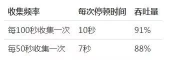
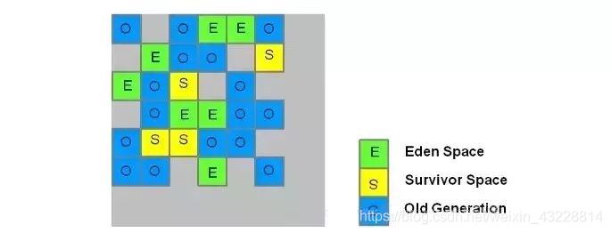

# 类加载机制

# 字节码执行机制

# JVM内存模型

# GC垃圾回收

# JVM性能调优与故障定位

# JVM调优

# JVM执行流程

首先通过编译器把 Java 代码转换成字节码，

类加载器（ClassLoader）再把字节码加载到内存中，将其放在运行时数据区（Runtime data area）的方法区内，

而字节码文件只是 JVM 的一套指令集规范，并不能直接交给底层操作系统去执行，因此需要特定的命令解析器执行引擎（Execution Engine），将字节码翻译成底层系统指令，

再交由 CPU 去执行，而这个过程中需要调用其他语言的本地库接口（Native Interface）与本地方法库来实现整个程序的功能。

# Java8中的方法区消失了？

**JAVA7**

堆：实例化的对象

虚拟机栈：方法栈，方法所需要的空间在栈中进行压栈，局部变量

方法区：类信息，代码，静态变量

​		 Java7及以前版本的Hotspot中方法区位于永久代中。同时，永久代和堆是相互隔离的，但它们使用的物理内存是连续的（为了效率物理内存是连续的）。永久代的垃圾收集是和老年代捆绑在一起的，因此无论谁满了，都会触发永久代和老年代的垃圾收集。

**java7中这样的物理内存设计   方法区  在加载jar包过多时会造成OOM的错误**

 		但在Java7中永久代中存储的部分数据已经开始转移到Java Heap或Native Memory中了。比如，符号引用(Symbols)转移到了Native Memory；字符串常量池(interned strings)转移到了Java Heap；类的静态变量(class statics)转移到了Java Heap。然后，在Java8中，Hotspot取消了永久代。永久代真的成了永久的记忆。永久代的参数-XX:PermSize和-XX：MaxPermSize也随之失效。

​		对于Java8，HotSpots取消了永久代，那么是不是就没有方法区了呢？当然不是，方法区只是一个规范，只不过它的实现变了。在Java8中，元空间(Metaspace)登上舞台，方法区存在于元空间(Metaspace)。同时，元空间不再与堆连续，而且是存在于本地内存（Native memory）。

**JAVA8**

https://www.choupangxia.com/2019/10/22/interview-jvm-gc-02/

# java7之后字符串常量池挪到堆中了

1.堆内回收效率较高

2.持久代或者元空间一般不会设置太大的值，避免OOM

# JVM垃圾收集器

**1.新生代的收集器包括**

1. Serial (复制算法)
2. PraNew (复制算法)
3. Parallel Scavenge(标记整理算法)

**2.老年代的收集器包括**

1. Serial Old(标记-整理算法)
2. Parallel Old(标记-整理算法)
3. CMS(标记-清除算法)

**3.回收整个Java堆(新生代和老年代)**

1. G1收集器（整体上是基于标记清理，局部采用复制）

   

**（一）新生代垃圾收集器**
**（1）Serial 收集器**

Serial 是一款用于新生代的单线程收集器，采用复制算法进行垃圾收集。Serial 进行垃圾收集时，不仅只用一条线程执行垃圾收集工作，它在收集的同时，所有的用户线程必须暂停（Stop The World）。

就比如妈妈在家打扫卫生的时候，肯定不会边打扫边让儿子往地上乱扔纸屑，否则一边制造垃圾，一遍清理垃圾，这活啥时候也干不完。

如下是 Serial 收集器和 Serial Old 收集器结合进行垃圾收集的示意图，当用户线程都执行到安全点时，所有线程暂停执行，Serial 收集器以单线程，采用复制算法进行垃圾收集工作，收集完之后，用户线程继续开始执行。

**适用场景：**Client 模式（桌面应用）；单核服务器。

可以用 -XX:+UserSerialGC 来选择 Serial 作为新生代收集器。

**（2）ParNew 收集器**

ParNew 就是一个 Serial 的多线程版本，其它与Serial并无区别。ParNew 在单核 CPU 环境并不会比 Serial 收集器达到更好的效果，它默认开启的收集线程数和 CPU 数量一致，可以通过 -XX:ParallelGCThreads 来设置垃圾收集的线程数。

如下是 ParNew 收集器和 Serial Old 收集器结合进行垃圾收集的示意图，当用户线程都执行到安全点时，所有线程暂停执行，ParNew 收集器以多线程，采用复制算法进行垃圾收集工作，收集完之后，用户线程继续开始执行。

适用场景：多核服务器；与 CMS 收集器搭配使用。当使用 -XX:+UserConcMarkSweepGC 来选择 CMS 作为老年代收集器时，新生代收集器默认就是 ParNew，也可以用 -XX:+UseParNewGC 来指定使用 ParNew 作为新生代收集器。

**（3）Parallel Scavenge 收集器**

Parallel Scavenge 也是一款用于新生代的多线程收集器，与 ParNew 的不同之处是ParNew 的目标是尽可能缩短垃圾收集时用户线程的停顿时间，Parallel Scavenge 的目标是达到一个可控制的吞吐量。

吞吐量就是 CPU 执行用户线程的的时间与 CPU 执行总时间的比值【吞吐量 = 运行用户代代码时间/（运行用户代码时间+垃圾收集时间）】，比如虚拟机一共运行了 100 分钟，其中垃圾收集花费了 1 分钟，那吞吐量就是 99% 。比如下面两个场景，垃圾收集器每 100 秒收集一次，每次停顿 10 秒，和垃圾收集器每 50 秒收集一次，每次停顿时间 7 秒，虽然后者每次停顿时间变短了，但是总体吞吐量变低了，CPU 总体利用率变低了。

可以通过 -XX:MaxGCPauseMillis 来设置收集器尽可能在多长时间内完成内存回收，可以通过

-XX:GCTimeRatio 来精确控制吞吐量。

如下是 Parallel 收集器和 Parallel Old 收集器结合进行垃圾收集的示意图，在新生代，当用户线程都执行到安全点时，所有线程暂停执行，ParNew收集器以多线程，采用复制算法进行垃圾收集工作，收集完之后，用户线程继续开始执行；在老年代，当用户线程都执行到安全点时，所有线程暂停执行，Parallel Old收集器以多线程，采用标记整理算法进行垃圾收集工作。

可以使用 -XX:+UseParallelGC 来选择 Parallel Scavenge 作为新生代收集器，jdk7、jdk8 默认使用 Parallel Scavenge 作为新生代收集器。

适用场景：注重吞吐量，高效利用 CPU，需要高效运算且不需要太多交互。

**（二）老年代垃圾收集器**

**（1）Serial Old 收集器**

Serial Old 收集器是 Serial 的老年代版本，同样是一个单线程收集器，采用标记-整理算法。

如下图是 Serial 收集器和 Serial Old 收集器结合进行垃圾收集的示意图：

适用场景：Client 模式（桌面应用）；单核服务器；与 Parallel Scavenge 收集器搭配；作为 CMS 收集器的后备预案。

**（2）CMS(Concurrent Mark Sweep) 收集器**

CMS 收集器是一种以最短回收停顿时间为目标的收集器，以 “ 最短用户线程停顿时间 ” 著称。整个垃圾收集过程分为 4 个步骤：

① 初始标记：标记一下 GC Roots 能直接关联到的对象，速度较快。

② 并发标记：进行 GC Roots Tracing，标记出全部的垃圾对象，耗时较长。

③ 重新标记：修正并发标记阶段引用户程序继续运行而导致变化的对象的标记记录，耗时较短。

④ 并发清除：用标记-清除算法清除垃圾对象，耗时较长。

整个过程耗时最长的并发标记和并发清除都是和用户线程一起工作，所以从总体上来说，CMS 收集器垃圾收集可以看做是和用户线程并发执行的。

CMS 收集器也存在一些缺点：

对 CPU 资源敏感：默认分配的垃圾收集线程数为（CPU 数+3）/4，随着 CPU 数量下降，占用 CPU 资源越多，吞吐量越小

无法处理浮动垃圾：在并发清理阶段，由于用户线程还在运行，还会不断产生新的垃圾，CMS 收集器无法在当次收集中清除这部分垃圾。同时由于在垃圾收集阶段用户线程也在并发执行，CMS 收集器不能像其他收集器那样等老年代被填满时再进行收集，需要预留一部分空间提供用户线程运行使用。当 CMS 运行时，预留的内存空间无法满足用户线程的需要，就会出现 “ Concurrent Mode Failure ”的错误，这时将会启动后备预案，临时用 Serial Old 来重新进行老年代的垃圾收集。

因为 CMS 是基于标记-清除算法，所以垃圾回收后会产生空间碎片，可以通过 -XX:UserCMSCompactAtFullCollection 开启碎片整理（默认开启），在 CMS 进行 Full GC 之前，会进行内存碎片的整理。还可以用 -XX:CMSFullGCsBeforeCompaction 设置执行多少次不压缩（不进行碎片整理）的 Full GC 之后，跟着来一次带压缩（碎片整理）的 Full GC。

适用场景：重视服务器响应速度，要求系统停顿时间最短。可以使用 -XX:+UserConMarkSweepGC 来选择 CMS 作为老年代收集器。
**（3）Parallel Old 收集器**

Parallel Old 收集器是 Parallel Scavenge 的老年代版本，是一个多线程收集器，采用标记-整理算法。可以与 Parallel Scavenge 收集器搭配，可以充分利用多核 CPU 的计算能力。

适用场景：与Parallel Scavenge 收集器搭配使用；注重吞吐量。jdk7、jdk8 默认使用该收集器作为老年代收集器，使用 -XX:+UseParallelOldGC 来指定使用 Paralle Old 收集器。

**（三）新生代和老年代垃圾收集器**

**G1 收集器**

G1 收集器是 jdk1.7 才正式引用的商用收集器，现在已经成为 jdk9 默认的收集器。前面几款收集器收集的范围都是新生代或者老年代，G1 进行垃圾收集的范围是整个堆内存，它采用 “ 化整为零 ” 的思路，把整个堆内存划分为多个大小相等的独立区域（Region），在 G1 收集器中还保留着新生代和老年代的概念，它们分别都是一部分 Region，如下图：

每一个方块就是一个区域，每个区域可能是 Eden、Survivor、老年代，每种区域的数量也不一定。JVM 启动时会自动设置每个区域的大小（1M ~ 32M，必须是 2 的次幂），最多可以设置 2048 个区域（即支持的最大堆内存为 32M*2048 = 64G），假如设置 -Xmx8g -Xms8g，则每个区域大小为 8g/2048=4M。

为了在 GC Roots Tracing 的时候避免扫描全堆，在每个 Region 中，都有一个 Remembered Set 来实时记录该区域内的引用类型数据与其他区域数据的引用关系（在前面的几款分代收集中，新生代、老年代中也有一个 Remembered Set 来实时记录与其他区域的引用关系），在标记时直接参考这些引用关系就可以知道这些对象是否应该被清除，而不用扫描全堆的数据。

G1 收集器可以 “ 建立可预测的停顿时间模型 ”，它维护了一个列表用于记录每个 Region 回收的价值大小（回收后获得的空间大小以及回收所需时间的经验值），这样可以保证 G1 收集器在有限的时间内可以获得最大的回收效率。

如下图所示，G1 收集器收集器收集过程有初始标记、并发标记、最终标记、筛选回收，和 CMS 收集器前几步的收集过程很相似：

① 初始标记：标记出 GC Roots 直接关联的对象，这个阶段速度较快，需要停止用户线程，单线程执行。

② 并发标记：从 GC Root 开始对堆中的对象进行可达新分析，找出存活对象，这个阶段耗时较长，但可以和用户线程并发执行。

③ 最终标记：修正在并发标记阶段引用户程序执行而产生变动的标记记录。

④ 筛选回收：筛选回收阶段会对各个 Region 的回收价值和成本进行排序，根据用户所期望的 GC 停顿时间来指定回收计划（用最少的时间来回收包含垃圾最多的区域，这就是 Garbage First 的由来——第一时间清理垃圾最多的区块），这里为了提高回收效率，并没有采用和用户线程并发执行的方式，而是停顿用户线程。

适用场景：要求尽可能可控 GC 停顿时间；内存占用较大的应用。可以用 -XX:+UseG1GC 使用 G1 收集器，jdk9 默认使用 G1 收集器。

**（四）JVM垃圾收集器总结**

主要介绍了JVM中的垃圾回收器，主要包括串行回收器、并行回收器以及CMS回收器、G1回收器。他们各自都有优缺点，通常来说你需要根据你的业务，进行基于垃圾回收器的性能测试，然后再做选择。下面给出配置回收器时，经常使用的参数：

-XX:+UseSerialGC：在新生代和老年代使用串行收集器

-XX:+UseParNewGC：在新生代使用并行收集器

-XX:+UseParallelGC ：新生代使用并行回收收集器，更加关注吞吐量

-XX:+UseParallelOldGC：老年代使用并行回收收集器

-XX:ParallelGCThreads：设置用于垃圾回收的线程数

-XX:+UseConcMarkSweepGC：新生代使用并行收集器，老年代使用CMS+串行收集器

-XX:ParallelCMSThreads：设定CMS的线程数量

-XX:+UseG1GC：启用G1垃圾回收器

