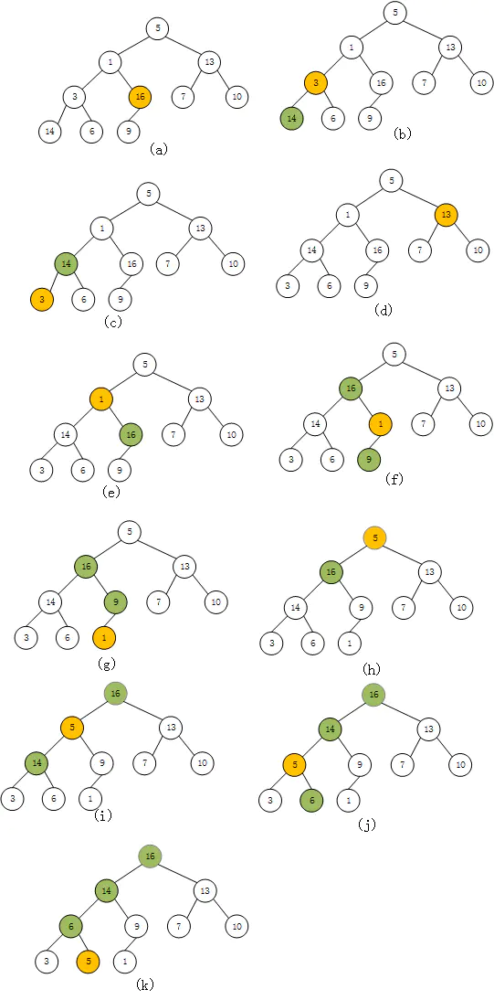

# 字符串

# 数组

# 链表

# 二叉树

# 堆

## 最大堆

1.首先我们需要找到最后一个结点的父结点如图(a),我们找到的结点是`16`,然后找出该结点的最大子节点与自己比较,若该子节点比自身大, 则将两个结点交换.      图(a)中,`16`是最大的结点,不需要交换.

2.我们移动到第下一个父结点`3`,如图(b)所示.同理做第一步的操作,交换了3和14,结果如图(c)所示.

3.移动结点到下一个父结点13,如图(d)所示,发现不需要做任何操作

4.移动到下个父结点1,如图(e)所示,然后交换1和16,如图(f)所示,此时我们发现交换后,1的子节点并不  是最大的,我们接着在交换(如图g)所示

5.移动到父结点到5,一次重复上述步骤,交换5和16,在交换14和5,在交换5和6
   所有节点交换完毕,最大堆构建完成

参看文献

https://www.jianshu.com/p/62b651797ad8

## 最小堆

# 栈

# 队列

# 哈希