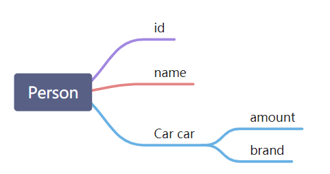
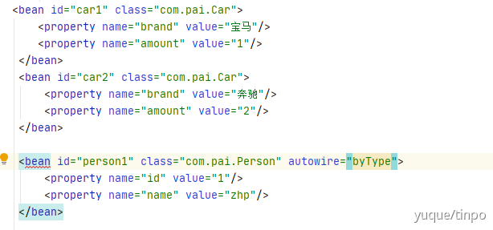

# Spring

## IOC自动装配（一般@autowire自动装配）



#### 1.ByName

```java
//例1
    <bean id="dog" class="com.heng.Tset2.Dog"/>
    <bean id="cat" class="com.heng.Tset2.Cat"/>
    <!--autowire="byName" 自动寻找和属性相关的bean，本质是set、方法，会自动匹配个个bean-->
    <bean id="add" class="com.heng.Tset2.Address" autowire="byName">
        <property name="name" value="主人"/>
        <!--<property name="cat" ref="cat"/>-->
        <!--<property name="dog" ref="dog"/>-->
    </bean>

```

```java
//例2
<bean id="car" class="com.pai.Car">
  <property name="brand" value="宝马"/>
  <property name="amount" value="1"/>
</bean>

<bean id="person" class="com.pai.Person" autowire="byName">
  <property name="id" value="1"/>
  <property name="name" value="zhp"/>
</bean>
```


#### 2.ByType（默认注入方式）

```java
//例1 
<!--
    byName: 会自动在容器上下文中查找，和自己对象set方法后面的值对应的 beanid！
    byType：会自动在容器上下文中查找，和自己对象属性类型相同的bean！
    -->
    <bean class="com.heng.Tset2.Cat"/>
    <bean class="com.heng.Tset2.Dog"/>
    <bean id="add2" class="com.heng.Tset2.Address" autowire="byType">
        <property name="name" value="主人"/>
    </bean>

```

//例2

这种注入规则不是按照属 性名称来判断注入哪个bean，而是通过属性的类型判断有没有相同类型（class）的bean，所以改名字也不怕了。



#### 3.gett/set方法注入

#### 4.构造器注入


## AOP

| 术语       | 解释                                                         |
| ---------- | ------------------------------------------------------------ |
| targrt     | 目标类，需要被增强的类                                       |
| join point | 连接点，目标类上需要被增强的方法，(这些方法可以被增强，也可以不增强，也就是说目标类 中所有的方法都可以称为是连接点) |
| point cut  | 切入点，被增强的方法(已经确定这个方法要被增强)，切入点就是一个连接点的子集 |
| advice     | 增强/通知，增强的代码，也就是上面将增强的代码凑成的一个类。类中的每个方法都代表一个 增强的功能代码，这个类中的方法就被称为通知 |
| weaving    | 织入，将切入点和通知结合，从没被增强到已经增强的过程         |
| aspect     | 切面，将切入点（point cut）和通知（advice）结合，切入点 和 通知点 多点形成面 |


# Spring MVC


# Spring Boot

**自动装配**


**整合WEB**


**整合数据库**


**整合全限**

如 Shiro

Spring Security


**整合中间件**

如缓存

MQ

RPC框架

NIO框架

# Junit单元测试

https://www.jianshu.com/p/a3fa5d208c93