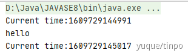
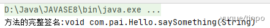
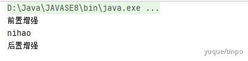
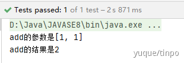

# Spring

## IOC装配方式


一般使用@autowire自动装配

#### 一、自动装配

##### 1.ByName

```java
//例1
    <bean id="dog" class="com.heng.Tset2.Dog"/>
    <bean id="cat" class="com.heng.Tset2.Cat"/>
    <!--autowire="byName" 自动寻找和属性相关的bean，本质是set、方法，会自动匹配个个bean-->
    <bean id="add" class="com.heng.Tset2.Address" autowire="byName">
        <property name="name" value="主人"/>
        <!--<property name="cat" ref="cat"/>-->
        <!--<property name="dog" ref="dog"/>-->
    </bean>

```

```java
//例2
<bean id="car" class="com.pai.Car">
  <property name="brand" value="宝马"/>
  <property name="amount" value="1"/>
</bean>

<bean id="person" class="com.pai.Person" autowire="byName">
  <property name="id" value="1"/>
  <property name="name" value="zhp"/>
</bean>
```


##### 2.ByType（默认注入方式）

```java
//例1 
<!--
    byName: 会自动在容器上下文中查找，和自己对象set方法后面的值对应的 beanid！
    byType：会自动在容器上下文中查找，和自己对象属性类型相同的bean！
    -->
    <bean class="com.heng.Tset2.Cat"/>
    <bean class="com.heng.Tset2.Dog"/>
    <bean id="add2" class="com.heng.Tset2.Address" autowire="byType">
        <property name="name" value="主人"/>
    </bean>

```

//例2

这种注入规则不是按照属 性名称来判断注入哪个bean，而是通过属性的类型判断有没有相同类型（class）的bean，所以改名字也不怕了。


#### 二、gett/set方法注入（无参构造）

```java
public class User {
    private String username;
    private String password;

    public void setUsername(String username) {
        this.username = username;
    }

    public void setPassword(String password) {
        this.password = password;
    }

    @Override
    public String toString() {
        return "User{" +
                "username='" + username + '\'' +
                ", password='" + password + '\'' +
                '}';
    }
}


//配置文件
<?xml version="1.0" encoding="UTF-8"?>
<beans xmlns="http://www.springframework.org/schema/beans"
       xmlns:xsi="http://www.w3.org/2001/XMLSchema-instance"
       xsi:schemaLocation="http://www.springframework.org/schema/beans http://www.springframework.org/schema/beans/spring-beans.xsd">

    <bean id="user" class="com.pai.User">
        <property name="username" value="pai"/>
        <property name="password" value="123456"/>
    </bean>
</beans>
```


#### 三、构造器注入(有参构造)

```java
package com.pai;

public class User {
    private String username;
    private String password;

    public User(String username, String password) {
        this.username = username;
        this.password = password;
    }

    @Override
    public String toString() {
        return "User{" +
                "username='" + username + '\'' +
                ", password='" + password + '\'' +
                '}';
    }
}


//配置文件
<?xml version="1.0" encoding="UTF-8"?>
<beans xmlns="http://www.springframework.org/schema/beans"
       xmlns:xsi="http://www.w3.org/2001/XMLSchema-instance"
       xsi:schemaLocation="http://www.springframework.org/schema/beans http://www.springframework.org/schema/beans/spring-beans.xsd">

    <bean id="user" class="com.pai.User">
        <constructor-arg name="username" value="zhang"/>
        <constructor-arg name="password" value="abcdef"/>
    </bean>
</beans>
```


## AOP

### 基本概念

|    术语    |                             解释                             |
| :--------: | :----------------------------------------------------------: |
|   target   |                    目标类，需要被增强的类                    |
| join point | 连接点，目标类上需要被增强的方法，(这些方法可以被增强，也可以不增强，也就是说目标类 中所有的方法都可以称为是连接点) |
| point cut  | 切入点，被增强的方法(已经确定这个方法要被增强)，切入点就是一个连接点的子集 |
|   advice   | 增强/通知，增强的代码，也就是上面将增强的代码凑成的一个类。类中的每个方法都代表一个 增强的功能代码，这个类中的方法就被称为通知 |
|  weaving   |     织入，将切入点和通知结合，从没被增强到已经增强的过程     |
|   aspect   | 切面，将切入点（point cut）和通知（advice）结合，切入点 和 通知点 多点形成面 |

```java
//1.添加依赖
<!--spring 相关依赖-->
<dependency>
  <groupId>org.springframework</groupId>
  <artifactId>spring-core</artifactId>
  <version>5.3.1</version>
</dependency>
<dependency>
  <groupId>org.springframework</groupId>
  <artifactId>spring-context</artifactId>
  <version>5.3.1</version>
</dependency>
<dependency>
  <groupId>org.springframework</groupId>
  <artifactId>spring-beans</artifactId>
  <version>5.3.1</version>
</dependency>
<dependency>
  <groupId>junit</groupId>
  <artifactId>junit</artifactId>
  <version>4.13</version>
</dependency>


<!--aop相关依赖-->
<dependency>
  <groupId>org.springframework</groupId>
  <artifactId>spring-aop</artifactId>
  <version>5.3.1</version>
</dependency>
<dependency>
  <groupId>org.aspectj</groupId>
  <artifactId>aspectjweaver</artifactId>
  <version>1.8.6</version>
</dependency>
    
//2.目标类
package com.pai;

public class Hello {
    public void sayHello(){
        System.out.println("hello");
    }
}
    
    
//3.增强类
package com.pai;

public class TimeHandler {
    public void printTime(){
        System.out.println("Current time:"+System.currentTimeMillis());
    }
}


//4.配置文件
<?xml version="1.0" encoding="UTF-8"?>
<beans xmlns="http://www.springframework.org/schema/beans"
       xmlns:p="http://www.springframework.org/schema/p"
       xmlns:c="http://www.springframework.org/schema/c"
       xmlns:util="http://www.springframework.org/schema/util"
       xmlns:context="http://www.springframework.org/schema/context"
       xmlns:aop="http://www.springframework.org/schema/aop"
       xmlns:xsi="http://www.w3.org/2001/XMLSchema-instance"
       xsi:schemaLocation="http://www.springframework.org/schema/beans
           http://www.springframework.org/schema/beans/spring-beans-4.0.xsd
           http://www.springframework.org/schema/util
           http://www.springframework.org/schema/util/spring-util-4.0.xsd
           http://www.springframework.org/schema/aop
           http://www.springframework.org/schema/aop/spring-aop-4.0.xsd
           http://www.springframework.org/schema/context
           http://www.springframework.org/schema/context/spring-context-4.0.xsd" >

    <bean id="hello" class="com.pai.Hello"/>
    <bean id="timeHandler" class="com.pai.TimeHandler"/>
    <aop:config>
        <aop:aspect id="time" ref="timeHandler">
            <aop:pointcut id="helloAllMethod" expression="execution(* com.pai.Hello.*(..))"/>
            <aop:before method="printTime" pointcut-ref="helloAllMethod"></aop:before>
            <aop:after method="printTime" pointcut-ref="helloAllMethod"></aop:after>
        </aop:aspect>
    </aop:config>
        
</beans>


//5.测试方法
import com.pai.Hello;
import junit.framework.TestCase;
import org.springframework.context.support.ClassPathXmlApplicationContext;

public class Test extends TestCase {

    public void test(){
        ClassPathXmlApplicationContext context = new ClassPathXmlApplicationContext("beans.xml");
        Hello hello = (Hello) context.getBean("hello");
        hello.sayHello();
    }
}
```




### 高级应用

通过joint point 获得连接信息

```java
//1.目标类
package com.pai;

public class Hello {
    public void saySomething(String something){
        System.out.println(something);
    }
}

//2.切面
package com.pai;

import com.sun.xml.internal.ws.client.RequestContext;
import org.aspectj.lang.JoinPoint;
import org.aspectj.lang.Signature;
import org.aspectj.lang.reflect.MethodSignature;

import java.lang.reflect.Method;
import java.util.Arrays;

public class TimeHandler {
    public void printTime(JoinPoint joinPoint){
        //获得方法的完整签名
        Signature signature = joinPoint.getSignature();
        System.out.println("方法的完整签名:"+ signature.toString());
    }
}

//3.配置类
<?xml version="1.0" encoding="UTF-8"?>
<beans xmlns="http://www.springframework.org/schema/beans"
       xmlns:p="http://www.springframework.org/schema/p"
       xmlns:c="http://www.springframework.org/schema/c"
       xmlns:util="http://www.springframework.org/schema/util"
       xmlns:context="http://www.springframework.org/schema/context"
       xmlns:aop="http://www.springframework.org/schema/aop"
       xmlns:xsi="http://www.w3.org/2001/XMLSchema-instance"
       xsi:schemaLocation="http://www.springframework.org/schema/beans
           http://www.springframework.org/schema/beans/spring-beans-4.0.xsd
           http://www.springframework.org/schema/util
           http://www.springframework.org/schema/util/spring-util-4.0.xsd
           http://www.springframework.org/schema/aop
           http://www.springframework.org/schema/aop/spring-aop-4.0.xsd
           http://www.springframework.org/schema/context
           http://www.springframework.org/schema/context/spring-context-4.0.xsd" >
    <bean id="hello" class="com.pai.Hello"/>
    <bean id="timeHandler" class="com.pai.TimeHandler"/>
    <aop:config>
        <aop:aspect id="time" ref="timeHandler">
            <aop:pointcut id="helloAllMethod" expression="execution(* com.pai.Hello.*(..))"/>
            <aop:before method="printTime" pointcut-ref="helloAllMethod"></aop:before>
        </aop:aspect>
    </aop:config>
</beans>
        
//4.测试
        import com.pai.Hello;
        import junit.framework.TestCase;
        import org.springframework.context.support.ClassPathXmlApplicationContext;

        public class Test extends TestCase {

            public void test(){
                ClassPathXmlApplicationContext context = new ClassPathXmlApplicationContext("beans.xml");
                Hello hello = (Hello) context.getBean("hello");
                hello.saySomething("nihao");
            }
        }
```




### 注解开发

```java
//1.目标类
@Component//表示为spring的一个bean
public class Hello {
    public void saySomething(String something){
        System.out.println(something);
    }
}

//2.切面
@Aspect
@Component
public class TimeHandler {

    @Pointcut("execution(* com.pai.Hello.*(..))")
    public void pointCut(){}

    @Before("pointCut()")
    public void before(JoinPoint joinPoint){
        System.out.println("前置增强");
    }

    @After("pointCut()")
    public void after(JoinPoint joinPoint){
        System.out.println("后置增强");
    }
}

//3.配置文件
<?xml version="1.0" encoding="UTF-8"?>
<beans xmlns="http://www.springframework.org/schema/beans"
       xmlns:p="http://www.springframework.org/schema/p"
       xmlns:c="http://www.springframework.org/schema/c"
       xmlns:util="http://www.springframework.org/schema/util"
       xmlns:context="http://www.springframework.org/schema/context"
       xmlns:aop="http://www.springframework.org/schema/aop"
       xmlns:xsi="http://www.w3.org/2001/XMLSchema-instance"
       xsi:schemaLocation="http://www.springframework.org/schema/beans
           http://www.springframework.org/schema/beans/spring-beans-4.0.xsd
           http://www.springframework.org/schema/util
           http://www.springframework.org/schema/util/spring-util-4.0.xsd
           http://www.springframework.org/schema/aop
           http://www.springframework.org/schema/aop/spring-aop-4.0.xsd
           http://www.springframework.org/schema/context
           http://www.springframework.org/schema/context/spring-context-4.0.xsd" >
    <context:component-scan base-package="com.pai"></context:component-scan>
    <aop:aspectj-autoproxy></aop:aspectj-autoproxy>
</beans>
        
//4.测试以及结果
        public class PersonTest extends TestCase {
            @Test
            public void testPerson(){
                ClassPathXmlApplicationContext context = new ClassPathXmlApplicationContext("beans.xml");
                Hello hello = (Hello) context.getBean("hello");
                hello.saySomething("nihao");
            }
        }
```



### 其它

在spring框架中我们不需要创建代理类，只需要创建一个切面类，spring会自动根据切面和目标类生成动态代理

```java
//1.目标类
package com.pai;

        public interface Cal {
            public int add(int num1,int num2);
        }

//2.实现
package com.pai;

import org.springframework.stereotype.Component;

        @Component
        public class CalImpl implements Cal{
            @Override
            public int add(int num1, int num2) {
                return num1+num2;
            }
        }

//3.添加依赖
<dependency>
  <groupId>org.springframework</groupId>
  <artifactId>spring-aop</artifactId>
  <version>5.3.1</version>
</dependency>
<dependency>
  <groupId>org.aspectj</groupId>
  <artifactId>com.springsource.org.aspectj.weaver</artifactId>
  <version>1.6.4.RELEASE</version>
</dependency>
<!-- https://mvnrepository.com/artifact/org.springframework/spring-aspects -->
<dependency>
  <groupId>org.springframework</groupId>
  <artifactId>spring-aspects</artifactId>
  <version>5.0.0.RELEASE</version>
</dependency>

//4.
    //需要明白三件事
    //在什么地方插入
    //什么时间插入
    //插入什么
 package com.pai;

import org.aspectj.lang.JoinPoint;
import org.aspectj.lang.annotation.After;
import org.aspectj.lang.annotation.AfterReturning;
import org.aspectj.lang.annotation.Aspect;
import org.aspectj.lang.annotation.Before;
import org.springframework.stereotype.Component;

import java.util.Arrays;

@Aspect
@Component
public class LoggerAspect {
    @Before("execution(public int com.pai.CalImpl.*(..))")//什么地方以及什么时间插入
    public void before(JoinPoint joinPoint){//插入什么
        String name = joinPoint.getSignature().getName();
        String args = Arrays.toString(joinPoint.getArgs());
        System.out.println(name+"的参数是"+args);
    }
    @AfterReturning(value = "execution(public int com.pai.CalImpl.*(..))",returning = "result")
    public void before(JoinPoint joinPoint,Object result){
        String name = joinPoint.getSignature().getName();
        System.out.println(name+"的结果是"+result);
    }
}

//5.配置文件
<?xml version="1.0" encoding="UTF-8"?>
<beans xmlns="http://www.springframework.org/schema/beans"
       xmlns:p="http://www.springframework.org/schema/p"
       xmlns:c="http://www.springframework.org/schema/c"
       xmlns:util="http://www.springframework.org/schema/util"
       xmlns:context="http://www.springframework.org/schema/context"
       xmlns:aop="http://www.springframework.org/schema/aop"
       xmlns:xsi="http://www.w3.org/2001/XMLSchema-instance"
       xsi:schemaLocation="http://www.springframework.org/schema/beans
           http://www.springframework.org/schema/beans/spring-beans-4.0.xsd
           http://www.springframework.org/schema/util
           http://www.springframework.org/schema/util/spring-util-4.0.xsd
           http://www.springframework.org/schema/aop
           http://www.springframework.org/schema/aop/spring-aop-4.0.xsd
           http://www.springframework.org/schema/context
           http://www.springframework.org/schema/context/spring-context-4.0.xsd" >
    <context:component-scan base-package="com.pai"></context:component-scan>
    <aop:aspectj-autoproxy></aop:aspectj-autoproxy>
</beans>

//6.测试代码
import com.pai.Cal;
import junit.framework.TestCase;
import org.springframework.context.ApplicationContext;
import org.springframework.context.support.ClassPathXmlApplicationContext;

public class Test extends TestCase {
    @org.junit.Test
    public void test(){
        ClassPathXmlApplicationContext context = new ClassPathXmlApplicationContext("bean.xml");
        Cal calImpl = (Cal) context.getBean("calImpl");
        calImpl.add(1,1);
    }
}

    
```




# Spring MVC


# Spring Boot

**自动装配**


**整合WEB**


**整合数据库**


**整合全限**

如 Shiro

Spring Security


**整合中间件**

如缓存

MQ

RPC框架

NIO框架

# Junit单元测试

https://www.jianshu.com/p/a3fa5d208c93